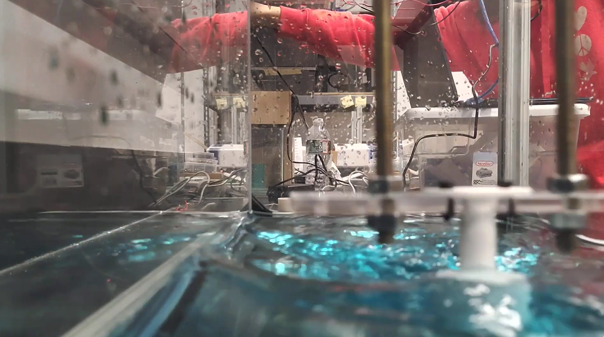

# Mini-Tow-Tank [Jun-Jul 2026]
Developed a mini tow tank to support research on bioluminescent algae as an alternative flow visualization technique. The control system uses closed-loop encoder feedback to achieve precise velocity(+/- 0.03 m/s from target) and repeatable motion, creating the flow conditions required for observing Kármán vortices in algae.

[Documentation & Instructions](Documentation/)  

  
Video link: (https://www.youtube.com/watch?v=F2ftbyinyw4)  

## Mechanical
- Applied first principles and Desmos to size and choose a DC motor, pulley diameter, determine electrical constraints, and choose the motor driver and corresponding wires (https://www.desmos.com/calculator/bqttl8z7cw)      
- Used Onshape to design and 3D print(gyroid infill to withstand shear stress) the belt tensioner sub-assembly and tow body.   
- Created a height adjustable gantry (to minimize tow body deflection at any fluid level) by laser cutting acrylic and using M8 threaded rods and nuts.   
- Machined an adapter sleeve(4mm motor shaft to 5mm inner-bore pulley) using a manual mill and lathe, created a platform for electronics using a table saw and drill press  

## Controls  
- Scripted a motor controller in C++ by taking the derivative of encoder position feedback to determine velocity, and creating functions to assign motor direction based on conditional statements.   
- Scripted and tuned a PI controller with feedforward   
- Wrote a program to empirically determine baseline/feedforward PWM for a desired velocity  
 
## Electrical  
- Created an embedded circuit containing an IBT2 motor driver, Arduino Uno, DC motor, ultrasound proximity sensor, and a relative magnetic encoder.   
- Learned about the different types of Encoders(Relative/Absolute, Magnetic/Rotary/Optic)
- Learned about Single H-Bridges & MOSFETs
- Learned about Low-Pass Filters 
- Wired & Created a Wiring diagram for the electronics:
 {Arduino, Proximity Sensor, IBT2 Motor Driver, Motor, Magnetic Encoder}

